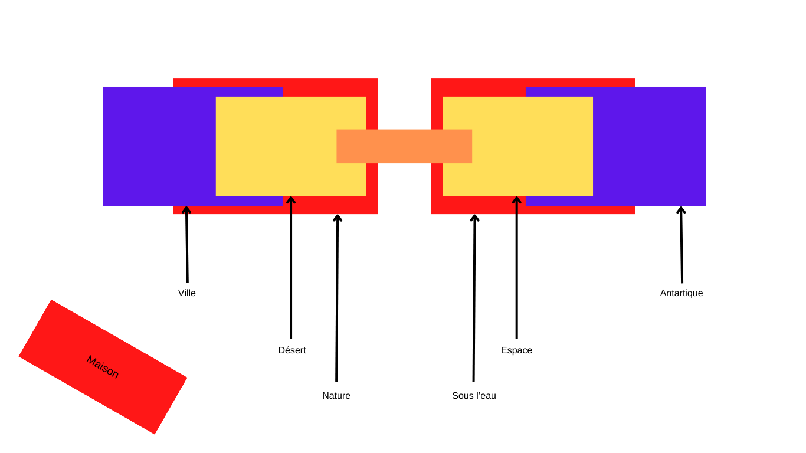

# Plan de projet

## Un résumé en une phrase 
Un jeu de plateforme et d'énigme

## Une description écrite de la proposition 

Le joueur commence dans une maison situé au bas du parcours.

L'objectif du jeu est d'atteindre la fin du parcours qui est divisé en six sections. 

Les joueurs sont accueillis par une vue panoramique sur le parcours qui s'étend devant eux.

Il devra grimper et se déplacer à travers le décor afin de se rendre à la fin.

Il devra braver différents climats et différentes énigmes qui viendront lui rajouter une difficulté.

Durant la montée, le joueur devra rechercher des pièces qui seront cachées dans des recoins du parcours.

Tout cela dans une ambiance calme et relaxante avec des bruits qui rappellent la nature.

Lorsque le joueur progresse, lees niveaux deviennent de plus en plus complexe.

À chaque fin d'étape, le joueur aura une vue panoramique sur le reste du parcours.

## Moodboard visuel 

## Moodboard sonore 
Ambiance

- [Musique Lofi](https://www.youtube.com/watch?v=n61ULEU7CO0)
- [Musique Minecraft](https://www.youtube.com/watch?v=G9sdTJGe7go)

Effets Sonores

- [Son gagner](https://www.youtube.com/watch?v=96YhBRqW6T4)
- [Ramasser pièce](https://www.youtube.com/watch?v=IueV6nwyreM)

## Une carte de votre environnement virtuel 

## Un schéma de programmation
### Joueur
- Peut prendre une prise après l'autre ce qui permet d'avancer
- Peut également tenir deux prises à l'aide de ses mains
- Lorsque les deux mains sont lachés, il tombe
- Peut se déplacer dans l'environnement
- Peut ramasser des pièces cachés
- Peut également ouvrir des chemins à l'aide de levier

### Changement de climats
- Nature : Aucun changements
- Ville : Des lumière éclairent le décor, le reste est plutôt sombre
- Désert : Le champ de vision du joueur est rétréci
- Espace : La gravité est affecté, le joueur devient plus "léger"
- Antartique : La vue du joueur devient plus agiter par moment
- Sous l'eau : La vue du joueur devient plus flou par moment
- Chaque cycle est réparti en fonction de sa section
