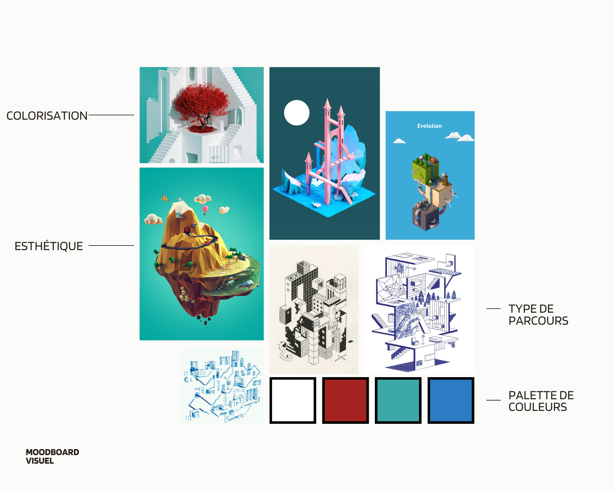

# Plan de projet

## Un résumé en une phrase 
Un simulateur d'escalade

## Une description écrite de la proposition 
## Moodboard visuel 

## Moodboard sonore 
Ambiance

- [Musique Lofi](https://www.youtube.com/watch?v=n61ULEU7CO0)
- [Musique Minecraft](https://www.youtube.com/watch?v=G9sdTJGe7go)

Effets Sonores

- [Son perdu](https://www.youtube.com/watch?v=voL49uXJiV4)
- [Son gagner](https://www.youtube.com/watch?v=96YhBRqW6T4)
- [Mouvement](https://www.youtube.com/watch?v=BMqDCws-C8o&t=26s)

## Une carte de votre environnement virtuel 
## Un schéma de programmation ou d'interactivité
